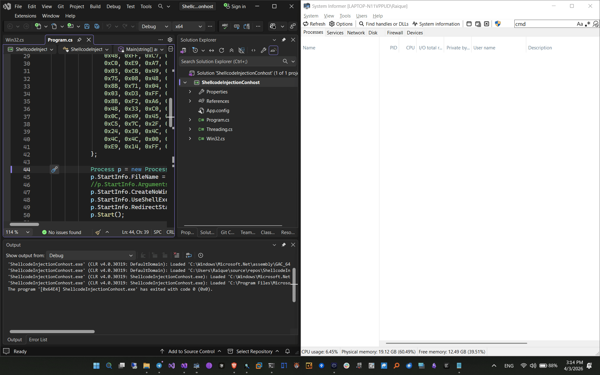

### INTERACTIVE SHELLCODE INJECTION ###
In this method you create a process like: cmd, conhost, powershell or even ssh, no need to create it in suspended state, you redirect its standard input to something you control, inject your shellcode wherever you want, and then you hijack the main thread which is in WAIT mode, in the case of the processes mentioned, they are in waiting mode waiting for use input, once you write any input to their standard input and have their main waiting thread hijacked, they will execute your shellcode, in case of ssh, you dont even need to input anything, just set -o ConnectTimeout=x that it will wait x seconds before executing, that is because its main thread enter in WAIT mode when attempting to connect 
